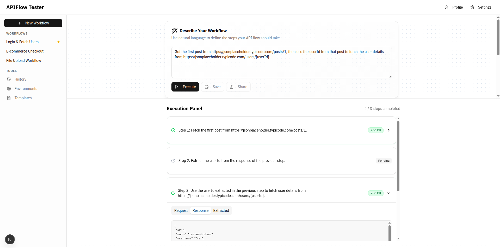
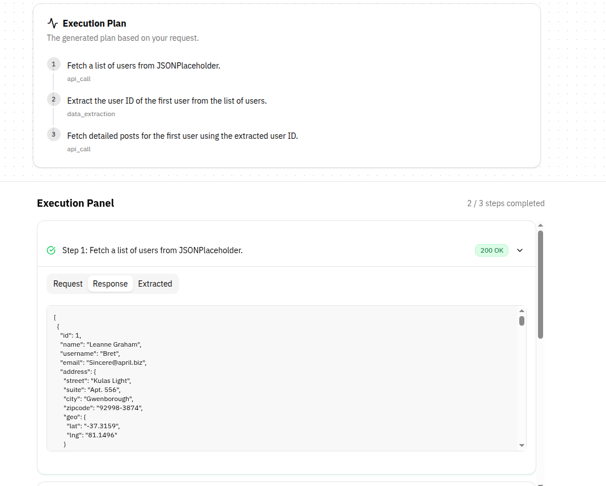

### 🚀 API Flow: The Lazy Person's API Workflow Automator


Tired of manual API testing?. API Flow lets you automate complex workflows using plain English.

**Before API Flow (The Pain):**

1.  Open Postman.
2.  Build `POST /auth/login`.
3.  Run it, then frantically copy the auth token.
4.  Build `GET /user/profile`.
5.  Paste the token into the header.
6.  Run it.
7.  Repeat until you question your life choices.

**With API Flow:**

```
"Log in with username 'test' and password 'pass', then get my user profile"
```

That's it. 🎉

### 🎬 See It In Action

Watch the demo to see API Flow in action: [📹 Demo Video](https://drive.google.com/file/d/1fUC-jY88cpd1mUfIdkwolTtRilsNX4j6/view?usp=sharing)

### 🏗️ How the Magic Happens

An AI-powered engine (using **Google Gemini & LangGraph**) acts as your brilliant, tireless intern. It takes your request, creates a multi-step plan, calls the APIs, and even cleverly passes data (like auth tokens) between steps. All you see is the result.


**Tech Stack:**

  * **Backend:** FastAPI, LangGraph, Python
  * **Frontend:** Next.js, React, TypeScript

### 🚀 Quick Start

**Prerequisites:**

  * Python 3.11+
  * Node.js 18+
  * A Google Gemini API Key

**Setup:**

**1. Clone the Repository**

Bash

```
git clone https://github.com/usman-faisal/api-flow.git
cd api-flow
```

**2. Backend Setup & Run**

```bash

cd backend

# Install dependencies with uv (recommended) or pip

uv sync

# OR

pip install -r requirements.txt

# Create environment file

cp .env.example .env

# Add your GEMINI_API_KEY to .env

# Start the FastAPI server

uv run fastapi dev

# OR

python -m uvicorn app.main:app --reload --port 8000

```


**3. Frontend Setup & Run**

```bash

cd frontend
# Create environment file

cp .env.example .env

# Install dependencies

pnpm install

# Start the development server

pnpm dev

```

Navigate to `http://localhost:3000` and start commanding your APIs like you own the place.